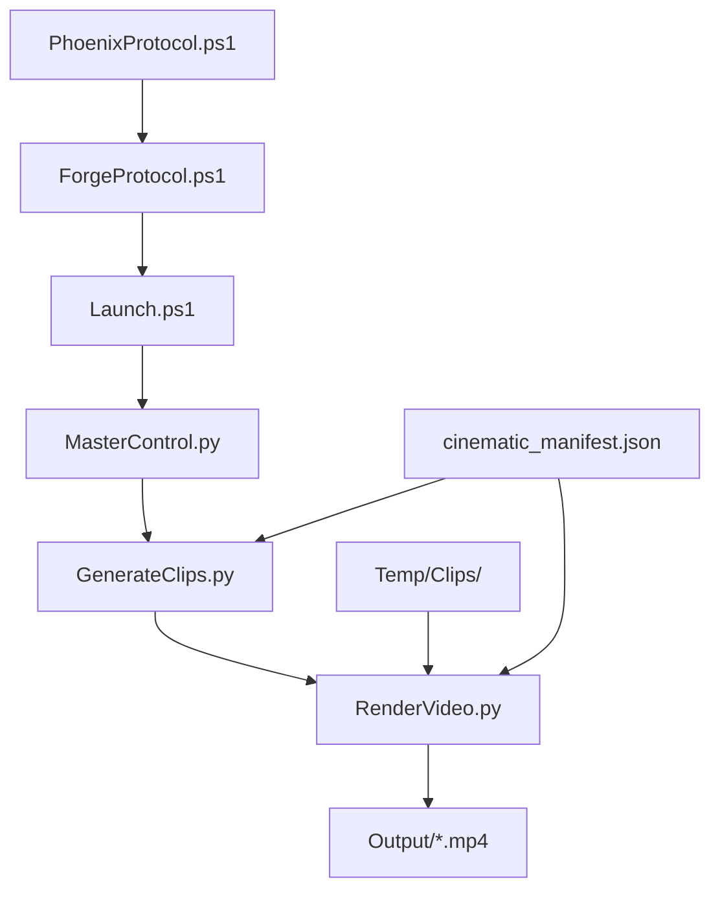

# ChimeraV2-Factory Pipeline Overview

## Technical Architecture

The ChimeraV2-Factory implements a modular video production pipeline designed for automated viral content generation.

### System Components



### Core Modules

#### 1. PhoenixProtocol.ps1
- **Purpose**: Factory initialization and legacy archival
- **Functions**:
  - Archive existing legacy systems
  - Create base directory structure
  - Generate factory manifest
- **Output**: Prepared factory environment

#### 2. ForgeProtocol.ps1 
- **Purpose**: Weapon system deployment with enhanced patches
- **Features**:
  - Robust directory creation with validation
  - FFmpeg dependency checking with installation guidance
  - Font path flexibility for cross-platform compatibility
  - Complete Python arsenal deployment
- **Critical Patches Applied**:
  - Directory existence validation
  - FFmpeg installation verification
  - System font fallback mechanisms

#### 3. Launch.ps1 (Red Button)
- **Purpose**: Complete pipeline orchestration
- **Workflow**:
  1. Manifest generation via MasterControl.py
  2. Clip generation via GenerateClips.py
  3. Final rendering via RenderVideo.py
- **Parameters**: Title, Duration, Clips count, Skip options

#### 4. MasterControl.py (The Brain)
- **Purpose**: Cinematic manifest generation
- **Features**:
  - Configurable video specifications
  - Clip timing and metadata generation
  - Cross-platform font path resolution
- **Output**: `cinematic_manifest.json` with complete production specs

#### 5. GenerateClips.py (Clip Generator)
- **Purpose**: FFmpeg-based placeholder clip generation
- **Features**:
  - Automated text overlay generation
  - Batch processing from manifest
  - Error handling and logging
- **Dependencies**: FFmpeg executable in PATH

#### 6. RenderVideo.py (Assembly Line)
- **Purpose**: Final video concatenation and encoding
- **Critical Fix Applied**: TEMP_FOLDER path resolution
- **Features**:
  - FFmpeg concat protocol usage
  - Automatic cleanup of temporary files
  - Robust error handling

### Data Flow

1. **Initialization**: PhoenixProtocol creates factory structure
2. **Deployment**: ForgeProtocol deploys all weapon systems
3. **Execution**: Launch orchestrates complete pipeline:
   - MasterControl generates manifest with clip specifications
   - GenerateClips creates individual video segments
   - RenderVideo concatenates segments into final output

### Configuration

#### Environment Variables
- `CHIMERA_FONT_PATH`: Custom font path for text overlays
- System font fallback: `arial` if custom font unavailable

#### Directory Structure
```
ChimeraV2-Factory/
├── Scripts/           # Python weapon systems
├── Temp/Clips/       # Temporary clip storage
├── Output/           # Final video outputs
├── docs/             # Documentation
└── *.ps1             # PowerShell orchestrators
```

### Error Handling

- **Dependency Validation**: FFmpeg and Python availability checks
- **Path Resolution**: Robust file system navigation
- **Graceful Degradation**: Font fallbacks and skip options
- **Comprehensive Logging**: Status reporting throughout pipeline

### Future API Hooks

The modular architecture enables:
- REST API integration for web-based control
- Database-driven manifest generation
- Cloud rendering backends
- Real-time progress monitoring
- Custom video template systems

### Performance Considerations

- Parallel clip generation potential
- Temporary file management
- Memory usage optimization for large video sets
- FFmpeg parameter tuning for quality vs. speed

### Security Features

- No hardcoded credentials
- Environment variable configuration
- Temporary file cleanup
- Input validation and sanitization